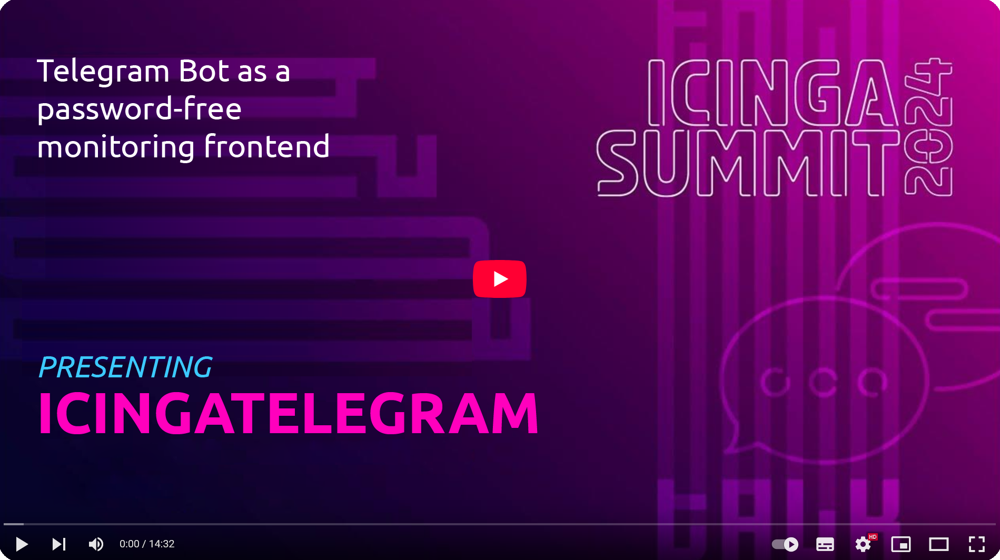

### Presenting at IcingaSummit'24 Berlin.
[](http://www.youtube.com/watch?v=uCQ-GEtN7hg "Icingatelegram at IcingaSummit'24")

[](https://github.com/xyhtac/icingatelegram/releases/tag/v.1.12)


### Abstract.
The [icingaweb](https://icinga.com/docs/icinga-web/latest/) front-end is powerful, but not exactly user-friendly. In our quest for a simpler solution, we explored various approaches to deliver system statuses seamlessly to both web and mobile applications, but we always stumbled over access management. Our customers weren’t thrilled to install yet another app and remember additional login details just to check if everything is running smoothly. So, we wanted a bridge between mobile devices and our monitoring data that didn’t involve app installations and password juggling.


### Notifications with Telegram Groups.
Icinga notifications to the Telegram have always worked well because of the popularity of the messenger. There is a variaty of scripts for sending notifications out there, pick one of your choice. I do prefer a minimalistic [bash script](https://github.com/lazyfrosch/icinga2-telegram) by *lazyfrosch*, it is also included in this package with minor modifications. Put these files to your icinga master:
```
conf.d/telegram-notifications.conf > /etc/icinga2/conf.d/
scripts/telegram-host-notification.sh > /etc/icinga2/scripts/
scripts/telegram-service-notification.sh > /etc/icinga2/scripts/
```
Next, go to [@BotFather](https://web.telegram.org/k/#@BotFather), set new bot name and description and grab a bot token. When attaching notifications to monitoring objects, opt for the Telegram supergroup IDs instead of individual user IDs. By associating notifications with the supergroup IDs, you are shifting access management from icinga configurations to the visually intuitive process of Telegram group administration, so you can perform user control tasks outside of your DevOps access scope. Go to your Telegram web or app, create new group, go to group settings, click on `add user`, find your new bot and check it. Now write something to your group and check if bot is actually getting updates:
```bash
curl --silent "https://api.telegram.org/[TELEGRAM_BOT_TOKEN]/getUpdates"
```
Find your message in the update list and copy ID of the supergroup. Now, edit `telegram-notifications.conf` and replace `TELEGRAM_BOT_TOKEN` with your bot token and `TELEGRAM_GROUP_ID` with the ID of your supergroup. Also, create new [API user](https://icinga.com/docs/icinga-2/latest/doc/12-icinga2-api/) on your icinga master host by adding a section to the `/etc/icinga2/conf.d/api-users.conf`:
```ts
object ApiUser "icingatelegram" {
  password = "icinga-api-secret-password"
}
```


### Interactive requests.
After completing these steps, you’ve successfully established a solid foundation for an interactive monitoring front-end based on Telegram. The next step involves updating our notifications bot to make it interactive. *Icingatelegram* connects with the Telegram API, acting as a webhook server, and interfaces with your icinga API to fetch monitoring data. 


The bot interacts with your users directly through private chats. However, to initiate a conversation, users must first send a `/sitrep` request from the corresponding group to which they belong. The underlying assumption is that all group members have access to a specific set of icinga services that you define in your configuration file. The group ID obtained from the initial request is utilized by the bot to determine the available dataset for the user and generate a session token. You can focus on delivering specific monitoring data to specific group ID on request and the Telegram will take care of the access control.


### Service configuration.
Buttons are configured in the `monitoring > service` section of config. First-level object defines a supergroup ID, second-level objects are action buttons, *_alias* is a mnemonic field for group description. Buttons are described by `name` object that stores captions in all supported languages, `type` ('text' or 'image') helps to distinguish text outputs and images, while `endpoint` holds a link to service or image.

```json
"service": {
    "-1004567891234": {
        "_alias": "Administrative Tech Group",
        "routers": {
            "name": {
                "en": "⚙️  Network Routers ",
                "ru": "⚙️  Сетевые Маршрутизаторы"
            },
            "type": "text",
            "endpoint": "SampleProject!services-network-routers"
        },
        "servers": {
            "name": {
                "en": "⚙️  Servers - Hardware",
                "ru": "⚙️  Серверы - Оборудование"
            },
            "type": "text",
            "endpoint": "SampleProject!project-servers-hardware"
        },
        "cpuload": {
            "name": {
                "en": "🧊  CPU Load",
                "ru": "🧊  Загрузка ЦП"
            },
            "type": "image",
            "endpoint": "http://graph.yourmonitoringmaster.org/S/a"
        }
    }
}
```


### Installation with tgbot-swarm.
*icingatelegram* is designed to be deployed as Docker app with [tgbot_swarm](https://github.com/xyhtac/tgbot-swarm) controller. To make it happen, follow these steps:

1. Prepare you tgbot_swarm node according to the [manual](https://github.com/xyhtac/tgbot-swarm/blob/prod/README.md).
2. Make your own clone of this repo.
3. Edit `pipeline/deploy-icingatelegram.jenkinsfile` according with you environment:
```groovy
environment {
        // General application Configuration
        VERBOSE = "1"
        DEPLOY = "dev"
        RETURN_BUTTON = "1"
        LANGUAGE = "ru"

        // Application-specific deploy configuration
        APP_NAME = "icingatelegram-bot"
        APP_DESCRIPTION = "IcingaTelegram_monitoring_interactive_service"
        APP_HOME = "icingatelegram"
        // Telegram bot token from Jenkins secret store
        TG_TOKEN = credentials("icingatelegram-tgtoken-${DEPLOY}")
        // Monitoring API password from Jenkins secret store
        MONITORING_PASS = credentials("icingatelegram-monitoring-${DEPLOY}") 
        MONITORING_USER = "icingatelegram"
        MONITORING_API = "https://icingaweb.yourmonitoringmaster.org:5665/v1/objects/services/"

        // Swarm host-specific deploy configuration
        API_PORT = "8443"
        API_PATH = "controller"
        API_HOST = "0.0.0.0"
        API_KEY = credentials("swarm-apikey-${DEPLOY}")
        // Swarm node hostname Jenkins secret store
        SWARM_HOSTNAME = credentials("swarm-hostname-${DEPLOY}")
        // SSH Passwords for Swarm node from Jenkins secret store
        SWARM_SSH_CRED = credentials("swarm-sshcred-${DEPLOY}")

}
```
4. Bot configuration is integrated to the deployment pipeline, therefore you should configure your *icingatelegram* in the `Generate service config` stage.
5. Add Telegram bot token and icinga API login and password to Jenkins secrets storage:
```
icingatelegram-monitoring-dev: icinga-api-secret-password
icingatelegram-tgtoken-dev:  telegram-bot-token
```
6. Create new Jenkins pipeline and point it to `deploy-icingatelegram.jenkinsfile` in your repo.
7. Run the pipeline.

> **_NOTE:_** *icingatelegram* stores session ID in the state memory, so your users will need to ask for access from the notification group after each time you run the build pipeline.


### Installation as systemd (CentOS).
If you wish to avoid using Docker and you are generally okay to dedicate port 443 of the host, you may set up icingatelegram as a systemd service on your host:
1. Install prerequisites:
```bash
yum install openssl git nodejs npm nano -y
```
2. Choose directory:
```bash
cd /opt
```
3. Clone repository:
```bash
git clone https://github.com/xyhtac/icingatelegram.git
```
4. Install Nodejs dependencies:
```bash
cd /opt/icingatelegram/icingatelegram
npm install
```
5. Create SSL key and certificate:
```bash
openssl req -newkey rsa:2048 -sha256 -nodes -keyout icingatelegram.key -x509 -days 3650 -out icingatelegram.pem -subj "/C=US/ST=New York/L=Brooklyn/O=Icinga /CN=icingatelegram-host-01.ydns.eu"
```
6. Create and edit `dev` configuration:
```bash
cp /opt/icingatelegram/icingatelegram/config/default.json /opt/icingatelegram/icingatelegram/config/local-dev.json
nano /opt/icingatelegram/icingatelegram/config/local-dev.json
```
```json
{
    "defaults": {
        "verbose": "1",
        "return-button": "1",
        "defaultLang": "ru"
    },
    "telegram": {
        "host": "0.0.0.0",
        "port": "443",
        "token": "telegram_bot_token",
        "url": "https://icingatelegram-host-01.ydns.eu:443/",
        "key": "icingatelegram.key",
        "cert": "icingatelegram.pem"
    },
    "monitoring": {
        "api_url": "https://icingaweb.yourmonitoringmaster.org:5665/v1/objects/services/",
        "username": "icingatelegram",
        "password": "icinga-api-secret-password",
        "service": {
            YOUR BUTTONS CONFIGURATION
        }
    },
    "interface": {
        INTERFACE OVERRIDE
    }
}
```
7. Try starting bot service manually:
```bash
npm start dev
```
> **_NOTE:_** Check console for errors and use `Ctrl` + `C` to stop Nodejs instance.
8. Copy systemd service template:
```bash
cp /opt/icingatelegram/scripts/icingatelegram.service /lib/systemd/system/icingatelegram.service
```
9. Enable and run service:
```bash
systemctl daemon-reload
systemctl enable icingatelegram
systemctl start icingatelegram
```


### Aggregation Services.
Configuring your Telegram bot with individual buttons for each monitoring service might not be the most efficient approach, as your infrastructure is likely to comprise numerous services. The rule of thumb is to limit the amount of buttons to a maximum of ten to fit an average device screen.

The only effective workaround is to introduce aggregated services into your icinga configuration. *Icingatelegram* comes with a set of predefined [aggregation services](/conf.d/aggregation-services.conf) that will help you to combine check results of hosts and services into one concatenated output, just like this:
```
PLUGIN OUTPUT

 OK: SERVICE DETAILS:
 * C_​BAK (snmp)​:
✅ snmp_​Disk C: Usage percent OK - 23 % 
✅ snmp_​Disk E - BACKUP: Usage percent OK - 76 % 
✅ snmp_​Physical Memory: Usage percent OK - 20 % 
✅ snmp_​cpu_​load: CPU Load percent OK - 0 % 

 * C_​FS (snmp)​:
✅ snmp_​Disk C: Usage percent OK - 75 % 
✅ snmp_​Disk E - STORAGE: Usage percent OK - 94 % 
✅ snmp_​Physical Memory: Usage percent OK - 18 % 
✅ snmp_​cpu_​load: CPU Load percent OK - 0 % 

 * C_​RDP (snmp)​:
✅ snmp_​Disk C: Usage percent OK - 88 % 
✅ snmp_​Physical Memory: Usage percent OK - 60 % 
✅ snmp_​cpu_​load: CPU Load percent OK - 3 % 

 * C_​DEV (snmp)​:
✅ snmp_​Disk C: Usage percent OK - 90 % 
✅ snmp_​Physical Memory: Usage percent OK - 49 % 
✅ snmp_​SAS_​E: Usage percent OK - 84 % 
✅ snmp_​cpu_​load: CPU Load percent OK - 1 % 

 * C_​PROD (snmp)​:
✅ snmp_​Disk C: Usage percent OK - 68 % 
✅ snmp_​Physical Memory: Usage percent OK - 41 % 
✅ snmp_​SAS_​R6_​F: Usage percent OK - 81 % 
✅ snmp_​SSD_​R1_​E: Usage percent OK - 82 % 
✅ snmp_​cpu_​load: CPU Load percent OK - 0 %
```

1. Add aggregation services to your icinga configuration. Service definitions are universal and should work well by default, no tweaks required:
```
conf.d/aggregation-services.conf > /etc/icinga2/conf.d/
```

> **_NOTE:_** By default the aggregated service always return ‘Ok’ status ignoring all statuses of listed services. This is done to avoid notifications to be originated by the dummy host. If you prefer the listed service state to be propagated to the dummy host, uncomment state calculation blocks.

2. Add sample-project.conf to your Icinga configuration. Change project name, rename hostgroups according to your environment:
```
conf.d/sample-project.conf > /etc/icinga2/conf.d/
```
3. Add `vars.type` and `vars.project` to your host definitions to add them into aggregation hostgroups.
4. Restart icinga service for the changes to take effect:
```bash
systemctl restart icinga2
```

Now you can add aggregated services to the configuration of your bot, i.e. `SampleProject!services-office-printers-toner` — you may copy this string from the URL field of your icingaweb on the service page.


### License
`icingatelegram` is licensed under the [MIT](https://www.mit-license.org/) license for all open source applications.

### Bugs and feature requests

Please report bugs [here on Github](https://github.com/xyhtac/icingatelegram/issues).
Guidelines for bug reports:
1. Use the GitHub issue search — check if the issue has already been reported.
2. Check if the issue has been fixed — try to reproduce it using the latest master or development branch in the repository.
3. Isolate the problem — create a reduced test case and a live example. 

A good bug report shouldn't leave others needing to chase you up for more information.
Please try to be as detailed as possible in your report.
Feature requests are welcome. Please look for existing ones and use GitHub's "reactions" feature to vote.


